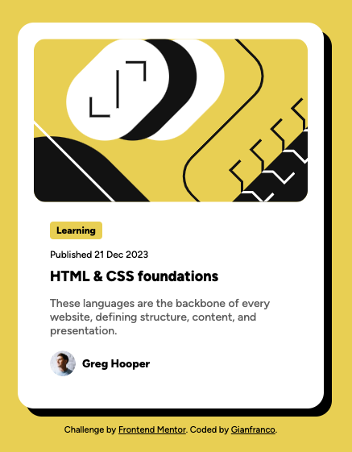

# Frontend Mentor - Blog Preview Card Solution

This is a solution to the [Blog Preview Card Challenge on Frontend Mentor](https://www.frontendmentor.io/challenges/blog-preview-card-ckPaj01IcS). Frontend Mentor challenges help improve your coding skills by building realistic projects.

## Table of Contents

- [Overview](#overview)
  - [The Challenge](#the-challenge)
  - [Screenshot](#screenshot)
  - [Links](#links)
- [My Process](#my-process)
  - [Built With](#built-with)
  - [What I Learned](#what-i-learned)
  - [Continued Development](#continued-development)
  - [Useful Resources](#useful-resources)
- [Author](#author)

---

## Overview

### The Challenge

Users should be able to:
- See hover and focus states for all interactive elements on the page.
- View a responsive design that adapts to mobile and desktop devices.

### Screenshot



---

### Links

- **Solution URL**: [https://github.com/GianfrancoAntenucci/Blog-preview-card](https://github.com/GianfrancoAntenucci/Blog-preview-card)
- **Live Site URL**: [https://gianfrancoantenucci.github.io/Blog-preview-card/](https://gianfrancoantenucci.github.io/Blog-preview-card/)

---

## My Process

### Built With

- HTML5 semantic markup
- CSS custom properties
- Flexbox
- CSS Grid
- Responsive design with media queries
- Mobile-first workflow

---

### What I Learned

While working on this project, I learned to:
- Implement responsive design by using media queries effectively.
- Create clean and modular CSS for flexibility and readability.
- Use `box-shadow` to achieve desired shadow effects, including pitch-black shadows and directional placement.
- Create typography emphasis using `font-weight` adjustments and responsive font sizes.

Here’s an example of CSS I’m proud of:

```css
.blog-card {
  padding: 20px;
  box-shadow: 10px 10px 0 0 rgba(0, 0, 0, 1); /* Bottom-right shadow */
  background-color: hsl(0, 0%, 100%);
  border-radius: 20px;
  overflow: hidden;
  width: 100%;
  max-width: 340px;
  height: auto; /* Height adjusts based on content by default */
  position: relative;
  cursor: pointer; /* Shows pointer on hover */
  transition: transform 0.2s ease; /* Smooth transition for hover effect */
}
```

---

### Continued Development

In future projects, I want to focus on:
- Improving animations and transitions for hover states.
- Exploring CSS custom properties for easier theme adjustments.
- Enhancing accessibility by following WCAG guidelines more rigorously.

---

### Useful Resources

- [Frontend Mentor Docs](https://www.frontendmentor.io/resources) - Great resources and tutorials for these challenges.
- [MDN Web Docs on CSS Box Shadow](https://developer.mozilla.org/en-US/docs/Web/CSS/box-shadow) - Helpful documentation on creating shadows.

---

## Author

- Website: [https://github.com/GianfrancoAntenucci](https://github.com/GianfrancoAntenucci)
- Frontend Mentor: [https://www.frontendmentor.io/profile/GianfrancoAntenucci](https://www.frontendmentor.io/profile/GianfrancoAntenucci)
- X: [https://x.com/ciaffo2011](https://x.com/ciaffo2011)

---

## Acknowledgments

Big thanks to the Frontend Mentor team for providing detailed challenges that simulate real-world design and development workflows!